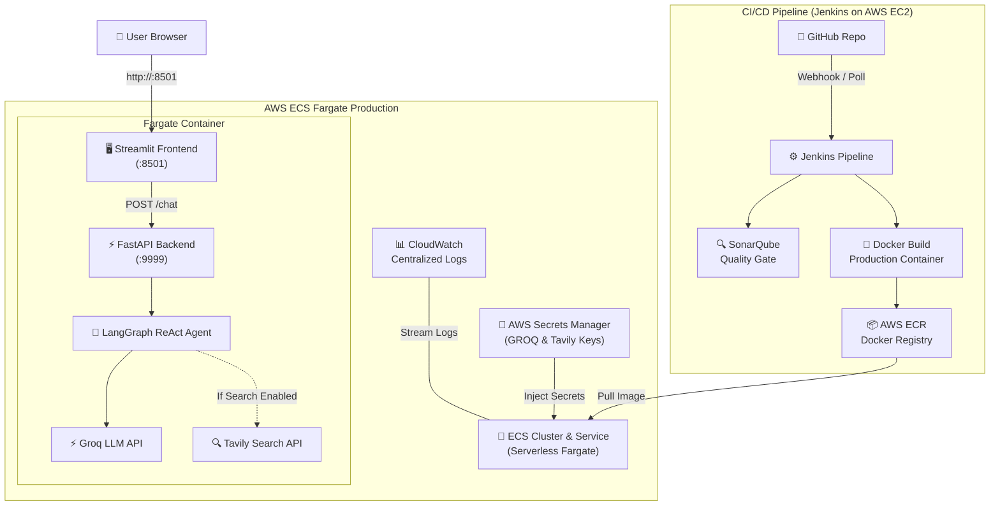

# 🤖 Multi-AI-Agent System with LangGraph, Groq, Tavily & LLMOps

A production-ready **Multi-AI-Agent system** powered by **LangGraph**, **Groq LPUs**, and **Tavily Web Search**. It features a **FastAPI** backend, an interactive **Streamlit** frontend with persistent chat history, and an end-to-end **LLMOps CI/CD pipeline** deploying automatically to **AWS ECS Fargate** via **Jenkins** and **SonarQube**.

---

## 🌟 Key Features

- **🧠 LangGraph ReAct Agent**: Intelligently decides between direct reasoning and live real-time web retrieval.
- **⚡ Ultra-Fast Groq Inference**: Low-latency responses utilizing models like `openai/gpt-oss-20b`, `openai/gpt-oss-120b`, and `qwen/qwen3.6-27b`.
- **🔍 Real-Time Tavily Web Search**: Live search tool integration for fact extraction, news summarization, and cited research.
- **🖥️ Interactive Streamlit UI**: Chat interface with persistent conversation history (`st.session_state`), loading spinners, and clean Markdown tables.
- **🚀 High-Performance FastAPI Backend**: REST API with strict Pydantic payload validation.
- **🔐 AWS Secrets Manager Integration**: Dynamic resolution of API keys with zero hardcoded credentials in production.
- **🔄 Complete CI/CD & LLMOps**: Jenkins pipeline with SonarQube code quality gates, automated Docker container builds, AWS ECR publishing, and ECS Fargate deployments.

---

## 🏗️ Architecture



---

## 🛠️ Technology Stack

| Layer | Technology | Purpose |
|---|---|---|
| **Agent Orchestration** | LangGraph & LangChain Core | ReAct (Reasoning + Acting) workflow graph |
| **LLM Inference** | Groq (`ChatGroq`) | Ultra-fast open-source LLM inference on LPUs |
| **Web Search Tool** | Tavily AI | Live web scraping and search fact extraction |
| **Backend API** | FastAPI + Uvicorn | RESTful chat endpoint (`/chat`) |
| **Frontend UI** | Streamlit | Interactive chat interface |
| **Cloud Compute** | AWS ECS Fargate | Serverless container execution |
| **Image Registry** | AWS ECR | Docker container repository |
| **Secret Management** | AWS Secrets Manager | Secure API key storage and injection |
| **Continuous Delivery** | Jenkins & SonarQube | Automated builds, quality checks & deployments |

---

## 📂 Directory Structure

```
MULTI-AI-AGENT-PROJECTS/
├── app/
│   ├── main.py                 # Multi-threaded runner (starts FastAPI + Streamlit)
│   ├── backend/
│   │   └── api.py              # FastAPI app with /chat endpoint
│   ├── frontend/
│   │   └── ui.py               # Streamlit web interface with persistent history
│   ├── core/
│   │   └── ai_agent.py         # LangGraph ReAct agent & tool calling logic
│   ├── config/
│   │   └── settings.py         # Dynamic config (Secrets Manager / .env fallback)
│   └── common/
│       ├── logger.py           # Centralized logging setup
│       └── custom_exception.py # Standardized exception handling
├── custom_jenkins/
│   └── Dockerfile              # Jenkins LTS with Docker-in-Docker & AWS CLI
├── .dockerignore               # Ignores .env, venv, and cache files
├── .gitignore                  # Git ignore rules
├── Dockerfile                  # Application production container definition
├── Jenkinsfile                 # 4-stage Jenkins CI/CD pipeline definition
├── requirements.txt            # Python dependencies
├── setup.py                    # Package installer
└── README.md                   # Project documentation
```

---

## 🚀 Getting Started (Local Development)

### 1. Prerequisites
- Python 3.10+ (Python 3.11 recommended)
- [Groq API Key](https://console.groq.com)
- [Tavily API Key](https://tavily.com) (for web search)

### 2. Clone the Repository
```bash
git clone https://github.com/souvikghosh-git/MULTI-AI-AGENT-PROJECTS.git
cd MULTI-AI-AGENT-PROJECTS
```

### 3. Set Up Virtual Environment & Dependencies
```bash
python3.11 -m venv venv
source venv/bin/activate

pip install -e .
```

### 4. Configure Environment Variables
Create a `.env` file in the root directory:
```env
GROQ_API_KEY="gsk_your_groq_api_key"
TAVILY_API_KEY="tvly-your_tavily_api_key"
```

### 5. Run the Application
```bash
python app/main.py
```

- **Frontend (Streamlit)**: [http://localhost:8501](http://localhost:8501)
- **Backend (FastAPI)**: [http://localhost:9999](http://localhost:9999)
- **API Documentation**: [http://localhost:9999/docs](http://localhost:9999/docs)

---

## 🐳 Running with Docker Locally

```bash
# Build the Docker image
docker build -t multi-ai-agent:latest .

# Run container passing local .env file
docker run -p 8501:8501 -p 9999:9999 --env-file .env multi-ai-agent:latest
```

---

## ☁️ Production Deployment on AWS

### 1. AWS Services Setup
1. **Secrets Manager**: Create secrets `multi-ai-agent/groq-api-key` and `multi-ai-agent/tavily-api-key`.
2. **ECR Repository**: Create an ECR repository named `my-repo`.
3. **IAM Roles**: Create `ecsTaskExecutionRole` with `AmazonECSTaskExecutionRolePolicy` and `SecretsManagerReadWrite`.
4. **ECS Cluster & Service**: Create ECS Cluster `multi-ai-agent-cluster` and Fargate service `multi-ai-agent-def-service-shqlo39p`.
5. **Security Groups**: Open ports `8501` (Streamlit) and `9999` (FastAPI).

### 2. Jenkins CI/CD Pipeline
The [`Jenkinsfile`](./Jenkinsfile) executes 4 automated stages on every push:

```groovy
pipeline {
    agent any
    environment {
        SONAR_PROJECT_KEY = 'LLMOPS'
        AWS_REGION        = 'us-east-1'
        ECR_REPO          = 'my-repo'
        IMAGE_TAG         = 'latest'
    }
    stages {
        stage('Cloning Github repo to Jenkins') { ... }
        stage('SonarQube Analysis') { ... }
        stage('Build and Push Docker Image to ECR') { ... }
        stage('Deploy to ECS Fargate') { ... }
    }
}
```

---

## 🤖 Supported Models & Capabilities

| Model ID | Provider | Tool Calling (Tavily Search) | Speed / Ideal Use Case |
|---|---|:---:|---|
| **`openai/gpt-oss-20b`** | OpenAI / Groq | ✅ Supported | ⚡ **Fastest** — Ideal for real-time web search & general tasks |
| **`openai/gpt-oss-120b`** | OpenAI / Groq | ✅ Supported | 🧠 **High Capacity** — Complex multi-step reasoning |
| **`qwen/qwen3.6-27b`** | Alibaba / Groq | ✅ Supported | 🔬 **Balanced** — Strong technical reasoning & coding |
| **`groq/compound`** | Groq | ⬜ Direct LLM | ⚡ Direct conversational generation |
| **`groq/compound-mini`** | Groq | ⬜ Direct LLM | ⚡ Ultra-low latency responses |
| **`allam-2-7b`** | Groq | ⬜ Direct LLM | ⚡ Lightweight conversational model |

---

## 👤 Author & Maintainer

- **Author**: Souvik Ghosh
- **Repository**: [souvikghosh-git/MULTI-AI-AGENT-PROJECTS](https://github.com/souvikghosh-git/MULTI-AI-AGENT-PROJECTS)
